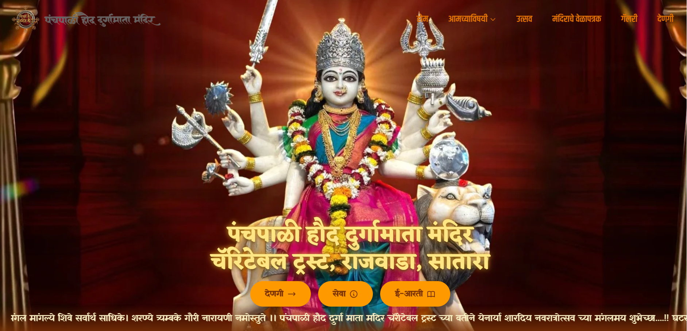

# 🛕 Panchapali Durgamata — Official Temple Website

### A Digital Spiritual Experience for Panchapali Durgamata Mandir

 

**[🌐 Live Website](https://www.panchapalidurgamata.org/) · [💼 LinkedIn Post](https://www.linkedin.com/posts/jayesh-jadhav-connect_webdevelopment-digitaltransformation-templewebsite-activity-7383011050754850816-eJq8) · [👤 Developer Portfolio](https://jayeshjadhav.com/)**

 

> ⚠️ **This repository contains only documentation.**
> The source code is proprietary and confidential — developed under a client agreement.

 

---

## 📌 Table of Contents

- [About the Project](#-about-the-project)
- [Live Website](#-live-website)
- [Pages & Features](#-pages--features)
- [Tech Stack](#-tech-stack)
- [Highlights](#-highlights)
- [Admin Panel](#-admin-panel)
- [Developer](#-developer)

---

## 🧠 About the Project

**Panchapali Durgamata Mandir** is a revered Hindu temple with a rich spiritual and cultural heritage. This is their official website — a full-stack freelance project that brings the temple's divine presence online, enabling devotees to access aarti lyrics, event schedules, gallery, donation info, and spiritual content — from anywhere in the world.

> Bridging spirituality and technology — bringing the temple experience to every devotee's screen. 🙏

---

## 🌐 Live Website

| 🔗 | Link |
|---|---|
| **Production** | [https://www.panchapalidurgamata.org](https://www.panchapalidurgamata.org/) |
| **LinkedIn Feature** | [View Post](https://www.linkedin.com/posts/jayesh-jadhav-connect_webdevelopment-digitaltransformation-templewebsite-activity-7383011050754850816-eJq8) |
| **Developer** | [https://jayeshjadhav.com](https://jayeshjadhav.com/) |

---

## 📄 Pages & Features

| Page | Description |
|---|---|
| 🏠 **Home** | Hero section, tagline banner, services, gallery & charitable activities |
| 🙏 **Aarti** | Full aarti lyrics with **Recite Mode** — guided recitation experience |
| 🎉 **Events** | Temple events listing, managed via admin panel |
| 📅 **Important Dates** | Hindu festival calendar & important temple dates |
| 🕌 **Religious Activities** | Temple's religious programs & seva details |
| 🖼️ **Gallery** | Photo & video gallery of temple events and festivals |
| 🎬 **GIF Gallery** | Video highlights & divine moments |
| 💰 **Donation** | Donation information with UPI QR code support |
| ℹ️ **About** | Temple history, significance & management info |
| 🔐 **Admin Panel** | Secure admin login to manage events & site settings |

---

## ✨ Highlights

| Feature | Details |
|---|---|
| 🕉️ **Aarti Recite Mode** | Step-by-step guided aarti recitation with scroll control |
| 🎬 **Video Gallery** | MP4 devotional content embedded natively |
| 📢 **Important Note Bar** | Dynamic scrolling announcements for devotees |
| 🔐 **Admin Dashboard** | Firebase-authenticated panel for managing events & settings |
| 💳 **UPI Donation QR** | Scan-to-donate for seamless contributions |
| 🗓️ **Festival Calendar** | Hindu festival dates with event details |
| 📊 **Firebase Firestore** | Real-time content management for events & notices |
| 🔍 **SEO Optimized** | Sitemap, robots.txt & structured metadata in Marathi + English |
| 📱 **Fully Responsive** | Mobile-first — optimized for devotees on all devices |
| ✨ **Micro-interactions** | ClickSpark, ScrollFloat & animated tagline banner |

---

## 🛠 Tech Stack

| Layer | Technology |
|---|---|
| **Framework** | [Next.js 14](https://nextjs.org/) — App Router (JS + TS hybrid) |
| **Language** | JavaScript (JSX) + TypeScript |
| **Styling** | [Tailwind CSS](https://tailwindcss.com/) |
| **Database** | [Firebase Firestore](https://firebase.google.com/) |
| **Auth** | Firebase Authentication (Admin panel) |
| **Storage** | Firebase Storage |
| **SEO** | Custom sitemap.xml + robots.txt |
| **Animations** | Custom ScrollFloat, ClickSpark, RotatingText components |
| **Deployment** | Static export via Next.js + `.htaccess` routing |

---

## 🔐 Admin Panel

The site includes a **password-protected admin dashboard** that allows the temple management to:

- ➕ Add / Edit / Delete upcoming events
- 📢 Update important announcements in real-time
- ⚙️ Manage site-wide settings — all without touching code

> Built with Firebase Authentication + Firestore for real-time, secure content management.

---

## 👤 Developer

**Jayesh Jadhav** — Freelance Full Stack Developer

> 💼 Available for freelance projects — reach out via [jayeshjadhav.com](https://jayeshjadhav.com/)

---

**© 2024 Panchapali Durgamata Mandir. All Rights Reserved.**

*Website designed & developed by [Jayesh Jadhav](https://jayeshjadhav.com/)*

🙏 *Jay Mata Di* 🙏

